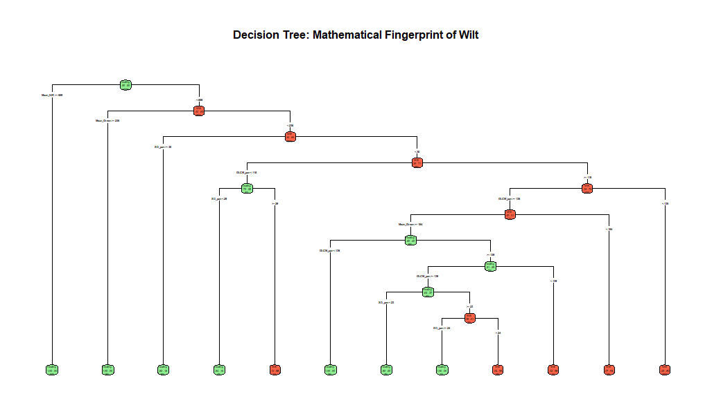

# Geospatial Analysis of Wilt Tree Disease 🌲🛰️


## Overview
This project focuses on identifying and modeling the presence of wilt disease in forestry using satellite spectral measurements (NIR, Red, Green bands). The repository contains the complete R codebase for exploratory data analysis, statistical hypothesis testing, and the deployment of machine learning classification models. 

**Note:** A full visual breakdown of the findings, methodology, and feature importance can be found in the included presentation deck: `Project Wilt Group 23.pdf`.

## Problem Statement
Detecting diseased trees in large geographical areas is highly resource-intensive. Furthermore, real-world forestry datasets often suffer from severe class imbalance (healthy trees vastly outnumber diseased ones), leading to biased predictive models.

## Methodology & Features
* **Exploratory Data Analysis:** Conducted statistical analysis using `ggplot2` and `corrplot` to visualize spectral band disparities between healthy and wilted trees.
* **Statistical Rigor:** Implemented hypothesis testing (t-tests) and generated confidence intervals to validate the statistical significance of Near-Infrared (NIR) measurements.
* **Class Imbalance Handling:** Utilized the `caret` package to perfectly balance the training data via up-sampling techniques, ensuring robust model performance.
* **Machine Learning Pipelines:** * Trained a robust **Random Forest** model (`ntree = 500`) to classify tree health and extract variable importance.
  * Developed an interpretable **Decision Tree** (`rpart`) to establish a mathematical fingerprint and threshold rules for wilt detection.
  * Deployed a minimal-variable model utilizing only NIR and Green bands to test efficiency.

## Tech Stack
* **Language:** R
* **Libraries:** `caret`, `randomForest`, `rpart`, `ggplot2`, `dplyr`, `corrplot`, `reshape2`
* **Core Concepts:** Up-sampling, Feature Importance, Classification Models, Statistical Hypothesis Testing

## Results & Visualizations



## How to Run

1. Clone the repository:
   ```bash
   git clone https://github.com/sivalakshmiveesamin-code/wilt-disease-geospatial-analysis.git
   ```
2. Ensure you have the necessary R packages installed:
   ```bash
   install.packages(c("dplyr", "ggplot2", "reshape2", "corrplot", "caret", "randomForest", "rpart", "rpart.plot"))
   ```
3. Make sure wilt_master_dataset.csv is in the same directory as the script.
4. Run the script via your preferred IDE (RStudio) or command line:
   ```bash
   Rscript analysis.R
   ```
